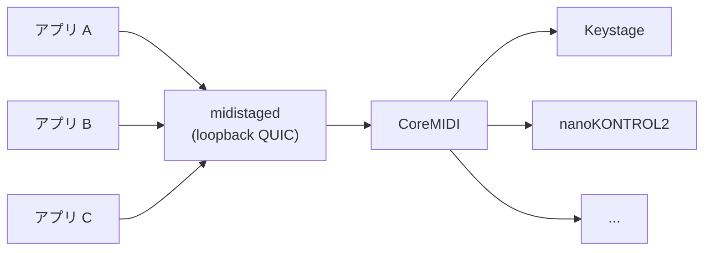

# midistage

[English](README.md) | **日本語**

MIDI コントローラーを使いたい macOS アプリのための、共通の作業机。

1 台の Mac で、複数のアプリが同じコントローラー（鍵盤、フェーダー、パッドなど）を使いたいことはよくあります。各アプリが実機を直接開くと、ポートを取り合い、LED が上書きされ、アプリを切り替えたときに音が鳴りっぱなしになったり SysEx が途中で切れたりします。midistage は実機の手前に 1 つのサービス **`midistaged`** を置きます。アプリは対等な client としてそこにつなぎ、各機材は一度に 1 つのアプリだけが使います。アプリ間の引き継ぎは明示的に、安全に行います。

> [!WARNING]
> 開発初期（v0.0.1）です。サービスと SDK は動作し、テストも通っていますが、実機での通し確認はまだです。API は変わります。macOS 専用です。

## できること

- **実機を開くのはサービスだけ。** 物理 MIDI ポートを開くのは `midistaged` だけです。各アプリには専用の仮想 MIDI source / destination（`native_midi`）が用意されるので、既存の MIDI 処理は CoreMIDI 経由のまま動きます。
- **機材ごとの担当。** 機材ごとに、保存される担当（どのアプリが使うか）と、実行中の使用権 lease（今どのアプリが使っているか）を持ちます。あるアプリで OFF にした機材は OFF のまま保たれます。
- **安全な引き継ぎ。** `active(A) → releasing(A, B) → active(B)` の間は入出力を止めます。A が発音を整理して `Quiesced` を返し、送信中の SysEx が完了してから B を active にします。タイムアウトだけで引き渡すことはしません。
- **安定した識別。** 機材は物理デバイス単位でまとめるので、挿し直しや USB ハブの交換でも担当が保たれます。同じ機種が 2 台あるなど判別できない場合は、推測せずエラーで止めます。
- **再起動しても設定が残る。** 担当は原子的に保存され、アプリの再接続時に復元されます。アプリが機材を特別な接続モードに切り替えていた場合（現状は Keystage）、引き継ぎ時とサービス終了時にサービスが元へ戻します。

認識する機材: KORG Keystage、KORG nanoKONTROL2、Akai LPD8 mk2、Melbourne Instruments Roto-Control、Behringer X-Touch、Studiologic Numa、Arturia MiniLab、Yamaha FGDP。それ以外の機材は汎用ポートとして一覧に出ます。



## 現状

| 構成要素 | 状態 |
|---|---|
| `midistaged`: 機材の検出、担当 / lease、引き継ぎ、`native_midi` の仮想ポート、`SendMidi` | 実装済み |
| Rust SDK（`midistage-client`）、Swift SDK（`MidistageClient`） | 実装済み |
| 正規化した操作イベントと `Present`（機材への名前・値・色の表示） | 型のみ定義。サービス側の処理は未実装（要求は明示的に失敗を返す） |
| 機材 profile（`midistage-profiles`）: Roto-Control / X-Touch / LPD8 mk2 の LED・表示出力と入力の変換 | 純粋な変換コードのみ。サービスにはまだ組み込んでいない（Keystage の接続モード処理は組み込み済み） |
| 設定 CLI `midistage`（KDL profile を `pull` / `push` / `diff` で同期。Keystage から） | 計画中。コマンドは雛形のみ |

## 必要なもの

- macOS 13 以降
- Rust 1.96.0。[`rust-toolchain.toml`](rust-toolchain.toml) で固定しているので、rustup が自動で選びます
- Swift 6 toolchain（Swift SDK を使う場合のみ）

## はじめかた

```bash
git clone https://github.com/chronista-club/midistage.git
cd midistage

# 物理 MIDI ポートを列挙する（何も開かず、何も送らない）
cargo run -p midistaged -- list-ports

# サービスを起動する
cargo run -p midistaged -- serve
```

`serve` は loopback の動的ポートで待ち受け、接続情報（pin する証明書と認証 token）を `~/Library/Application Support/Midistage/endpoint.json` に書き出します。ユーザーごとに 1 つだけ起動します。置き場所は `--state-dir <path>` で変えられます。止めるときは Ctrl-C か SIGTERM です。

## アプリから使う

**Swift** — このリポジトリを Swift package として追加し、`MidistageClient` product に依存します。

```swift
import MidistageClient

let (client, snapshot) = try await Client.connect(clientID: "com.example.app", displayName: "Example")
for await event in client.events {
    // snapshot の更新、Quiesce の要求など
}
```

**Rust** — `crates/midistage-client`:

```rust
use midistage_client::{Client, Endpoint, Event, Hello, Quiesced, protocol::PROTOCOL_VERSION};

let path = std::env::var("HOME")? + "/Library/Application Support/Midistage/endpoint.json";
let endpoint: Endpoint = serde_json::from_slice(&std::fs::read(path)?)?;
let hello = Hello {
    protocol_version: PROTOCOL_VERSION,
    client_id: "com.example.app".into(),
    display_name: "Example".into(),
    auth_token: endpoint.auth_token.clone(),
    native_midi: true,
    initial_enabled_profiles: vec![],
};
let (client, snapshot) = Client::connect(&endpoint, hello).await?;

loop {
    match client.recv_event().await? {
        Event::Quiesce { device_id, lease_token, .. } => {
            // この機材で鳴らしている音を止めてから引き渡す
            client.quiesced(&Quiesced { device_id, lease_token }).await?;
        }
        _ => {}
    }
}
```

アプリは接続して snapshot（機材、その phase、自分用の仮想ポート）を読み、使いたい機材を `SetEnabled` で有効にします。別のアプリが機材を引き継ぐときは、`Quiesce` に `Quiesced` で応えます。どちらの SDK も、protocol の版が違うサービスとは通信せず、動いているサービスを再起動したり置き換えたりしません。

通信の契約は [`schemas/midistage.kdl`](schemas/midistage.kdl) で、[Unison](https://github.com/chronista-club/club-unison) protocol の上に載っています。設計の全文は [`docs/design/03-runtime-service.md`](docs/design/03-runtime-service.md) にあります。

## リポジトリの構成

```
crates/
  midistaged/          サービス本体: CoreMIDI、セッション、設定、引き継ぎ
  midistage-protocol/  wire 型と状態遷移（I/O なし）
  midistage-client/    Rust SDK
  midistage-profiles/  機材固有の入力・表示変換（I/O なし）
  midistage-core/      UMP、KORG SysEx、CoreMIDI FFI
  midistage-keystage/  Keystage の設定モデル（設定 CLI 用）
  midistage-cli/       設定 CLI `midistage`（計画中）
clients/swift/         Swift SDK
schemas/               通信の契約（KDL）
docs/design/           設計文書
```

## 開発

```bash
mise run check      # mbx check --workspace --all-targets
mise run test       # mbx test --workspace
mise run clippy     # mbx clippy --workspace --all-targets
cargo fmt --all -- --check
scripts/test-sdk-interop.sh   # Swift SDK と Rust サービスの相互テスト
```

`mise` の task は、ビルドキャッシュを共有するために [mbx](https://mr-boxington.jdx.dev/) 経由で cargo を実行します。素の `cargo` でも動きます。

## ライセンス

[Apache License 2.0](LICENSE-APACHE) と [MIT license](LICENSE-MIT) のどちらかを選んで利用できます。

`midistage-core` の UMP と CoreMIDI binding のコードは [cplp-sound-system](https://github.com/chronista-club/cplp-sound-system)（MIT）から流用しています。

製品名は各社の商標です。本プロジェクトはどのハードウェアメーカーとも関係ありません。
