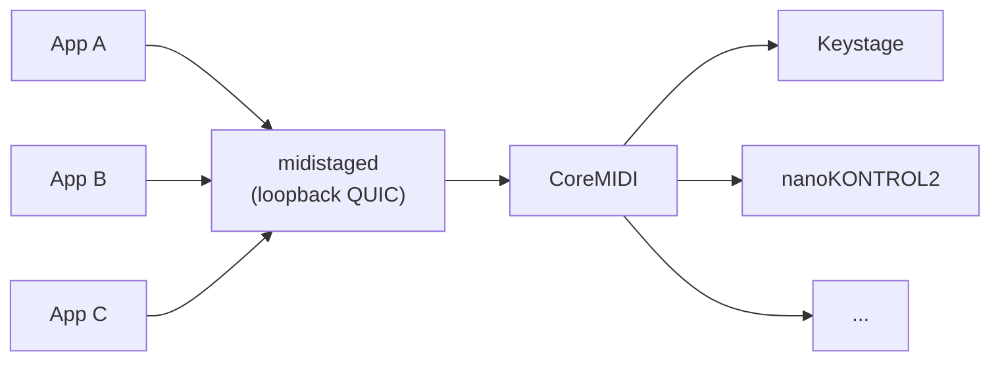

# midistage

**English** | [日本語](README.ja.md)

One home for your MIDI controllers, shared by every app on your Mac.

Several apps on one Mac often want the same controllers — a keyboard, a fader box, a pad grid. When each app opens the hardware directly, they fight over ports, LEDs get overwritten, and switching apps leaves stuck notes or half-sent SysEx. midistage puts one service, **`midistaged`**, in front of the hardware. Apps connect to it as equal clients, and each device is used by one app at a time, with explicit and safe handoff between them.

> [!WARNING]
> Early development (v0.0.1). The service and SDKs work and are tested, but have not yet been verified end-to-end on hardware. APIs will change. macOS only.

## What it does

- **One owner for the hardware.** Only `midistaged` opens physical MIDI ports. Each app gets its own virtual MIDI source / destination (`native_midi`), so existing MIDI code keeps working through CoreMIDI.
- **Per-device assignment.** Each device has a saved assignment (which app should use it) and a running lease (which app is using it now). Turning a device off for an app sticks.
- **Safe handoff.** On `active(A) → releasing(A, B) → active(B)`, input and output pause, A cleans up its notes and replies `Quiesced`, in-flight SysEx completes, and only then does B become active. A timeout alone never hands a device over.
- **Stable identity.** Devices are grouped by physical device, so assignments survive replugging and USB hub changes. Ambiguous setups (two identical units) stop with an error instead of guessing.
- **Settings survive restarts.** Assignments are written atomically and restored when an app reconnects. If an app switched a device into a special connection mode (currently Keystage), the service switches it back on handoff and on shutdown.

Recognized devices: KORG Keystage, KORG nanoKONTROL2, Akai LPD8 mk2, Melbourne Instruments Roto-Control, Behringer X-Touch, Studiologic Numa, Arturia MiniLab, Yamaha FGDP. Other devices show up as generic ports.



## Status

| Component | State |
|---|---|
| `midistaged`: discovery, assignment / lease, handoff, `native_midi` bridge ports, `SendMidi` | Implemented |
| Rust SDK (`midistage-client`), Swift SDK (`MidistageClient`) | Implemented |
| Normalized control events and `Present` (name / value / color on the device) | Types defined; runtime adapter not yet implemented (requests fail explicitly) |
| Device profiles (`midistage-profiles`): LED / display output and input decoding for Roto-Control, X-Touch, LPD8 mk2 | Pure conversion code, not yet wired into the service (the Keystage connection-mode handling is) |
| `midistage` configurator CLI (KDL profiles with `pull` / `push` / `diff`, starting with Keystage) | Planned; commands are stubs |

## Requirements

- macOS 13 or later
- Rust 1.96.0, pinned in [`rust-toolchain.toml`](rust-toolchain.toml) (rustup picks it up automatically)
- Swift 6 toolchain, only for the Swift SDK

## Getting started

```bash
git clone https://github.com/chronista-club/midistage.git
cd midistage

# List physical MIDI ports (opens nothing, sends nothing)
cargo run -p midistaged -- list-ports

# Start the service
cargo run -p midistaged -- serve
```

`serve` listens on a dynamic loopback port and writes connection details (a pinned certificate and an auth token) to `~/Library/Application Support/Midistage/endpoint.json`. Only one instance runs per user. Use `--state-dir <path>` to change the location. Stop it with Ctrl-C or SIGTERM.

## Using it from an app

**Swift** — add this repository as a Swift package and depend on the `MidistageClient` product:

```swift
import MidistageClient

let (client, snapshot) = try await Client.connect(clientID: "com.example.app", displayName: "Example")
for await event in client.events {
    // Snapshot updates, Quiesce requests, ...
}
```

**Rust** — `crates/midistage-client`:

```rust
use midistage_client::{Client, Endpoint, Event, Hello, Quiesced, protocol::PROTOCOL_VERSION};

let path = std::env::var("HOME")? + "/Library/Application Support/Midistage/endpoint.json";
let endpoint: Endpoint = serde_json::from_slice(&std::fs::read(path)?)?;
let hello = Hello {
    protocol_version: PROTOCOL_VERSION,
    client_id: "com.example.app".into(),
    display_name: "Example".into(),
    auth_token: endpoint.auth_token.clone(),
    native_midi: true,
    initial_enabled_profiles: vec![],
};
let (client, snapshot) = Client::connect(&endpoint, hello).await?;

loop {
    match client.recv_event().await? {
        Event::Quiesce { device_id, lease_token, .. } => {
            // Release notes held on this device, then hand it over.
            client.quiesced(&Quiesced { device_id, lease_token }).await?;
        }
        _ => {}
    }
}
```

An app connects, reads the snapshot (devices, their phases, its own bridge ports), enables the devices it wants with `SetEnabled`, and answers `Quiesce` with `Quiesced` when another app takes a device over. Both SDKs refuse to talk to a service with a different protocol version and never restart or replace a running service.

The wire contract is [`schemas/midistage.kdl`](schemas/midistage.kdl), on the [Unison](https://github.com/chronista-club/club-unison) protocol. Full design: [`docs/design/03-runtime-service.md`](docs/design/03-runtime-service.md) (Japanese).

## Repository layout

```
crates/
  midistaged/          service: CoreMIDI, sessions, settings, handoff
  midistage-protocol/  wire types and state machine (no I/O)
  midistage-client/    Rust SDK
  midistage-profiles/  device-specific input / display conversion (no I/O)
  midistage-core/      UMP, KORG SysEx, CoreMIDI FFI
  midistage-keystage/  Keystage settings model (configurator)
  midistage-cli/       `midistage` configurator CLI (planned)
clients/swift/         Swift SDK
schemas/               wire contract (KDL)
docs/design/           design documents (Japanese)
```

## Development

```bash
mise run check      # mbx check --workspace --all-targets
mise run test       # mbx test --workspace
mise run clippy     # mbx clippy --workspace --all-targets
cargo fmt --all -- --check
scripts/test-sdk-interop.sh   # Swift SDK against the Rust service
```

The `mise` tasks run cargo through [mbx](https://mr-boxington.jdx.dev/) for a shared build cache. Plain `cargo` works too.

## License

Licensed under either of [Apache License 2.0](LICENSE-APACHE) or [MIT license](LICENSE-MIT), at your option.

UMP and CoreMIDI binding code in `midistage-core` is adapted from [cplp-sound-system](https://github.com/chronista-club/cplp-sound-system) (MIT).

Product names are trademarks of their respective owners. This project is not affiliated with any hardware manufacturer.
