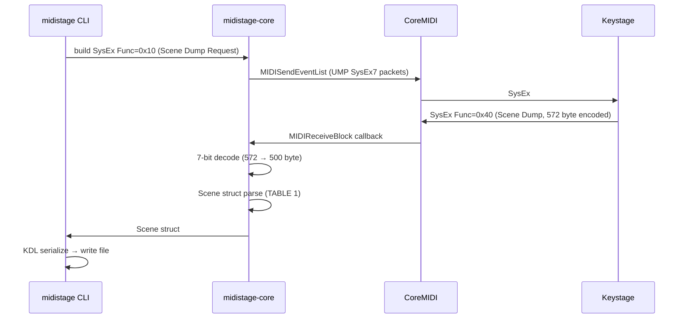
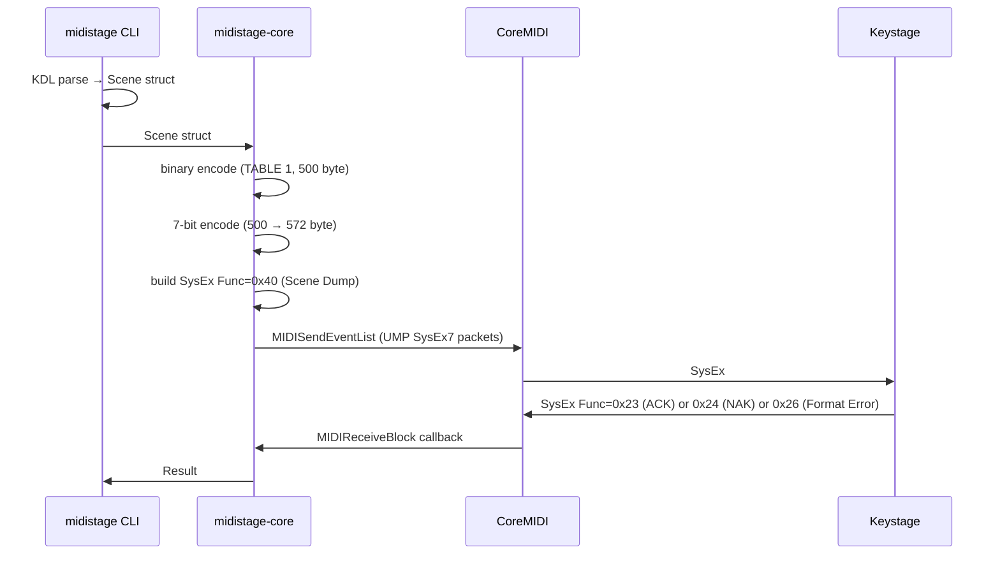

# midistage Architecture

> **Layer 1 canonical doc** (repo-tracked、 Living Documentation primary source)
> Layer 2 trace (history / context / decisions の経緯) は creo-memories `midistage` Atlas (`atl_1CahBrpoKgKy1WbiNpzD8w`) 参照
> 起点 LANE: `vantage-point/mako/keystage` (2026-05-04)

## Purpose

`midistage` は **KORG MIDI 2.0 device configurator CLI**。 declarative な KDL profile を git で管理し、 round-trip (pull / push / diff) で device に同期する。 KORG が提供する KORG KONTROL EDITOR (GUI editor) を排除して、 **CLI 1 撃で完結する dogfood 環境**を提供する。

起点は KORG **Keystage** (MIDI 2.0 / Polyphonic Aftertouch / 49-key)、 将来は LPD8 等の他 device も plugin module で扱う **device-agnostic な MIDI 設定 framework** に育てる。

### Design principles

- **Declarative file = source of truth**: device 上の状態は projection、 真実は KDL file (= git で履歴管理)
- **Round-trip 同期**: dogfood 中の試行錯誤は device 上で行い、 良い設定が見つかったら `pull` で file 化 (= 真実を file に固定)
- **GUI 排除、 CLI 1 撃**: KONTROL EDITOR の subset を CLI で superset 化、 lane 別 profile / git diff / PR レビュー可能
- **Device-agnostic abstraction**: Keystage / LPD8 / 他 device を plugin module として扱う

## System Architecture

```mermaid
graph TB
    subgraph "midistage workspace"
        CLI["midistage-cli<br/>(binary `midistage`)"]
        Core["midistage-core<br/>(transport + protocol + encoding)"]
        Keystage["midistage-keystage<br/>(Scene/Global struct + KDL serde)"]
        LPD8["midistage-lpd8<br/>(v1+ 予定)"]

        CLI --> Core
        CLI --> Keystage
        CLI -.-> LPD8
        Keystage --> Core
        LPD8 -.-> Core
    end

    subgraph "OS Layer (macOS)"
        CoreMIDI["CoreMIDI.framework"]
    end

    subgraph "Device"
        Device["KORG Keystage<br/>(MIDI 2.0 / UMP)"]
    end

    Core -->|FFI| CoreMIDI
    CoreMIDI -->|UMP| Device
```

### Crate responsibilities

| crate | 責務 | 含む概念 |
|-------|------|---------|
| `midistage-core` | transport + protocol + encoding の **device-agnostic 基盤** | UMP packet (decode / encode)、 KORG SysEx builder、 7-bit encoding、 MIDI-CI Discovery + PE GET、 CoreMIDI FFI binding |
| `midistage-cli` | CLI binary `midistage` | 9 subcommand (list-ports / list-profiles / init / pull / push / diff / scene-change / mode / controller-mode)、 KDL file I/O、 device 選択 logic |
| `midistage-keystage` | Keystage device module | Scene Data (500B) struct、 Global Data (3667B) struct、 KDL ↔ struct ↔ binary の 3 形式 serde |
| `midistage-lpd8` (v1+) | LPD8 device module | LPD8 用 SysEx (MIDI 1.0)、 8 pad + 8 knob 設定 |

## Protocol Stack

| layer | protocol | 用途 |
|-------|---------|------|
| **transport** | UMP packet (MIDI 1.0 MT=0x2 / MIDI 2.0 MT=0x4 / SysEx7 MT=0x3) | host ↔ device の bytestream 運搬 |
| **identify** | MIDI-CI Discovery (Sub ID #2 = 0x70/0x71) + Property Exchange GET (0x34/0x35) | DeviceInfo / X-ParameterList 取得 (read-only) |
| **read** | KORG SysEx Func=0x10 (scene) / 0x0E (global) | `pull` の trigger、 device → host の dump |
| **write** | KORG SysEx Func=0x40 (scene) / 0x51 (global) / 0x11 (memory write) | `push`、 device の internal state 書き換え |
| **encoding** | KORG 7-bit encoding (8-byte block: 1 high-bit byte + 7 data byte) | SysEx 内の binary data 表現 |

### Important: PE は Read-Only

KORG Keystage の MIDI-CI Property Exchange は **Set Property Data (0x36/0x37) を Recognized 行に持たない** (`Keystage_PE_MIDIimp.txt` §1)。 これは **MIDI Association の意図的な spec 線引き**: PE は「device が host に capabilities を expose する標準化された path」 で、 internal mapping の write は依然 manufacturer 固有領域 (= KORG SysEx)。 v0 design はこれに従う:

- **read**: PE GET (補助、 DeviceInfo / X-ParameterList) + KORG SysEx Func=0x10/0x0E (主、 全 setting)
- **write**: KORG SysEx Func=0x40/0x51 のみ (PE 経由の write は不可)

## Data Flow

### `pull` (device → file)



### `push` (file → device)



### `diff` (no write)

`pull` と同じ sequence で device 状態取得 → file の Scene struct と field-level 比較 → unified-diff like 表示。 **device 上の手動変更を可視化する safety net**。

### `init` (device 接続不要)

device 通信せず、 KORG defaults 値を埋め込んだ blank KDL profile を生成。 `~/.config/midistage/<profile>.kdl` に書き出し。 dogfood の入りの楽さ。

### "file あれば push、 無ければ pull" pattern

将来的に `midistage sync <profile>` として実装予定: file が存在すれば `push`、 無ければ `pull` (= 初回 scaffold)。 cplp-sound-system の `KeystageManager.swift::loadOrDumpScene()` に reference 実装あり、 dogfood 中の体験が良い。

## File Format

KDL (KDL Document Language) を採用。 詳細仕様は `03-file-format-kdl.md` (v0-α 実装と同期で起こす)。

### Why KDL?

- KORG Scene Data の **本質的に階層的な構造** (`scene → knob/button → midi-channel/cc/value`) を natural nesting で表現
- KDL の `/-` slash-dash で node 単位 comment-out 可能 (試行錯誤に強い)
- chronista-club ecosystem (fleetflow / bikeboy) で dogfood 済み、 ユーザー認知 cost 低い

### Path

```
~/.config/midistage/<profile>.kdl   # World layer の住人 (host で 1 set、 project agnostic)
```

例: `keystage-default.kdl` / `keystage-vp-dev.kdl` / `keystage-stage.kdl`

## VP HP Integration (Future, separate PR)

VP の Hermit Purple 🍇 container は `midistage` を **child process spawn** する pattern:

```rust
// VP HP container 内 (vp daemon に統合される予定)
let output = Command::new("midistage")
    .args(["push", "vp-dev"])
    .output()?;
```

LPD8 path (`vp midi lpd8 write|switch`) と同じ pattern。 HP の責務 = orchestration、 protocol 詳細 = midistage に閉じる。 LSCM catalog P2 候補 `MidiCapability 独立 Stand 化` の実体化。

## Vendor Provenance

`midistage-core` の `coremidi_sys.rs` と `ump.rs` は **`cplp-sound-system/crates/cplp-midi`** から vendor in (γ、 snapshot 2026-05-04):

| file | 由来 | 状態 |
|------|------|------|
| `crates/midistage-core/src/coremidi_sys.rs` | cplp-midi/src/coremidi_sys.rs (186 行) | RX-only FFI binding。 TX 側 (`MIDIOutputPortCreate` / `MIDISendEventList`) は v0-α で追加 |
| `crates/midistage-core/src/ump.rs` | cplp-midi/src/ump.rs (322 行) | UMP decoder のみ。 encoder + SysEx7 packet (MT=0x3) 構築は v0-α で追加 |

各 file 先頭に attribution コメント、 commit `84e9098` の commit message にも明記。 v1+ で **α 正規化** (cplp-sound-system 側を `midistage-core` 依存に切替) を計画。

## v0 Roadmap

| stage | scope | 達成条件 |
|-------|-------|---------|
| **v0-α** (high priority、 dogfood MVP) | `pull` 1 撃成立 | 6 core todo (CoreMIDI Output FFI / 7-bit encoding / Scene struct / KORG SysEx builder / KDL serialize / 3 commands `list-ports`/`init`/`pull`) |
| **v0-β** (medium、 round-trip 完成) | `push` + `diff` 動く | 3 todo (`push` / `diff` / KDL deserializer) |
| **v0-γ** (medium、 全領域) | Global / mode / controller-mode 対応 | 3 todo (Global Data struct / 3 補助 subcommand / MIDI-CI Discovery + PE GET) |
| **v1+** (将来) | VP HP 統合 / LPD8 module / α 正規化 / publish (δ) | 別 LANE / 別 PR |

todo 一覧は creo-memories `midistage` Atlas に 12 個起票済 (`mem_1CahC1FL...` 〜 `mem_1CahC3yc...`)。

## References

- KORG 公式 MIDI Implementation: `~/repos/cplp-sound-system/docs/midi/Keystage/Keystage_MIDIimp.txt` (1115 行、 v1.00 2023.8.31)
- KORG PE Implementation: 同上 `Keystage_PE_MIDIimp.txt` (312 行)
- KORG PE Resource List: 同上 `Keystage_PE_ResourceList.txt` (156 行)
- Swift 先行実装: `~/repos/cplp-sound-system/apple/CplpSoundSystem/Sources/macOS/Midi/KeystageManager.swift` (250 行)
- 詳細 protocol: `02-protocol-keystage.md`
